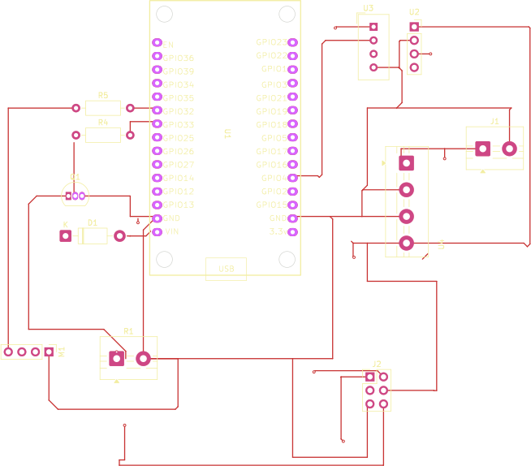

# Poultry Environmental Control - Telemetry Console


Production-grade, API-driven telemetry dashboard for a smart poultry environment.
Django backend, Edge-AI-ready JSON REST API, server-side environmental classifier,
a two-board ESP-NOW hardware pipeline (ESP32 sensor node + ESP32-S3 master node
running an on-device TFLite Micro forecast/spike model), a standalone sensor
simulator for development without hardware, and a standard Bootstrap 5
dashboard (dual-line forecast charts, actuator control, live console feed,
historical reports/CSV export; Bootstrap and Chart.js are both vendored
locally for air-gapped operation).

## About

This is the minor project of four undergraduate students in the Department of
Electronics and Computer Engineering, **Thapathali Campus, Institute of
Engineering (IOE), Tribhuvan University**, submitted in partial fulfillment of
the Bachelor's degree in Electronics, Communication and Information
Engineering (August 2026), under the supervision of **Er. Anup Shrestha**.

It's a closed-loop environmental control system for a poultry shed: an ESP32
sensor node reads temperature/humidity/ammonia and drives the fan and heater,
an ESP32-S3 master node forecasts the next reading with an on-device
TFLite Micro model, and a Django dashboard classifies, logs, and visualizes
the whole thing in real time. See [Documentation & Reports](#documentation--reports)
for the full report and defense decks, and [Designs](#designs) for the PCB.

## Architecture

```
sensor_simulator.py  ──HTTP POST──>  /api/telemetry/submit/
   (Virtual sensor,                     │ validate -> classify -> persist
    5 s cadence,                        ▼
    random walk +               PoultryTelemetry (SQLite, indexed timestamp)
    anomaly injection)                  │
                                        ▼
dashboard (browser)  ──HTTP GET──>  /api/telemetry/historical/?hours=N
   (5 s polling loop feeds metrics grid, charts, audit log)
```

Physical hardware replaces the simulator with a two-board pipeline (the
Django/dashboard side above is unchanged either way):

```
hardware/esp32/ (DevKit V1, sensor node)  --ESP-NOW-->  hardware/esp32s3_master/ (ESP32-S3, master node)
   DHT11 + MQ-137 + fan/heater                     TFLite Micro forecast + spike model
              ^                                              |
              `------------ ESP-NOW (classification) <-------'  --WiFi/HTTP--> /api/telemetry/submit/
```

The master node is the only board that talks to Django; the sensor node only
ever exchanges fixed-size binary structs with the master over ESP-NOW. See
`hardware/esp32/README.md` and `hardware/esp32s3_master/README.md` for the full pipeline,
wiring, and the MAC-address pairing procedure the two boards need before
they can talk to each other.

| Component | Path |
|---|---|
| Data model + classification enum | `telemetry/models.py` |
| Pure classifier decision framework + spike-risk threshold | `telemetry/classifier.py` |
| API views (submit / historical) + dashboard shell | `telemetry/views.py` |
| URL map | `telemetry/urls.py`, `config/urls.py` |
| Virtual sensor client (dev/demo, no hardware needed) | `sensor_simulator.py` |
| ESP32 sensor-node firmware (DHT11 + MQ-137, ESP-NOW, actuator loop) | `hardware/esp32/src/main.cpp`, `hardware/esp32/include/config.h` |
| ESP32-S3 master-node firmware (ESP-NOW receive, TFLite Micro inference, WiFi/HTTP to Django) | `hardware/esp32s3_master/src/main.cpp`, `hardware/esp32s3_master/include/config.h` |
| Dashboard template | `telemetry/templates/telemetry/dashboard.html` |
| Console stylesheet / client runtime | `telemetry/static/telemetry/dashboard.css`, `dashboard.js` |
| Unit tests (classifier + API + forecast + spike-risk contracts) | `telemetry/tests.py` |

## Classifier rules (first match wins)

1. `ammonia_level > 15.0` -> `CRITICAL_AMMONIA` (dark red background, white text)
2. `temperature > 35.0` (live reading OR the Edge-AI forecast alone) -> `HEAT_STRESS_WARNING` (orange border, orange text) -- no humidity condition
3. `temperature < 18.0` -> `LOW_TEMP_ALERT` (deep blue text, light blue accents)
4. otherwise -> `OPTIMAL_ENVIRONMENT` (charcoal grid, solid green indicator dot)

Classification is computed server-side at ingestion, before the INSERT, so every
stored row is complete and immutable. Thresholds are exposed in the historical
API response so the front end never hardcodes them.

## API

`POST /api/telemetry/submit/`
```json
{
  "temperature": 29.4,
  "humidity": 61.2,
  "ammonia_level": 8.7,
  "predicted_temperature": null,
  "predicted_ammonia": null,
  "predicted_spike_probability": null
}
```
Returns `201` with the persisted record including `predicted_class`.

Forecast channels (`predicted_temperature`, `predicted_ammonia`,
`predicted_spike_probability`) are optional and nullable: absent key, explicit
null, and numeric value are all accepted, since the ESP32-S3 master node may not
be linked yet. When numeric, `predicted_temperature`/`predicted_ammonia` are
bounds-checked against the same physical envelope as their live counterparts,
and `predicted_spike_probability` (the master's TFLite Micro spike-classifier
output) is bounds-checked to `[0, 1]`. All three serialize back as JSON null
when absent, so chart clients can rely on key presence. Classification is
always driven by live readings only; forecasts and spike risk are advisory
overlays. Payloads with missing live fields, non-numeric values, or readings
outside physical/probability envelopes are rejected with `400`.

`GET /api/telemetry/historical/?hours=24`
Returns records in the trailing window, ascending chronologically, plus the active
threshold set — ready for direct ingestion by chart libraries.

## Running the system

Two terminals.

Terminal 1 — backend and dashboard:
```bash
pip install -r requirements.txt
python manage.py migrate
python manage.py runserver 0.0.0.0:8000
# Dashboard (this machine):  http://127.0.0.1:8000/
# Dashboard (other devices, e.g. a phone on the same WiFi): http://<this-machine's-LAN-IP>:8000/
```

Binding `0.0.0.0` (not the default `127.0.0.1`) matters if you're using the
physical ESP32-S3 master node -- it needs to reach this over WiFi, and it
finds the LAN IP itself via UDP broadcast discovery (see
`hardware/esp32s3_master/README.md`), so there's no IP to hardcode on either
side. `ALLOWED_HOSTS` is left open (`"*"`) in `config/settings.py` for the
same reason -- this is a dev-only server, never expose it beyond a trusted
LAN.

Terminal 2 — virtual sensor:
```bash
python sensor_simulator.py
# Edge-AI forecast emulation is ON by default so the KPI forecast lines,
# dashed chart series, console (Pred: ...) markers, and the AI spike-risk
# card all have live numbers. To transmit null forecasts/spike-risk
# (matching the deployment state before the ESP32-S3 master node is linked):
python sensor_simulator.py --no-edge-ai
```

The simulator transmits every 5 seconds using an Ornstein-Uhlenbeck-style random
walk (Gaussian step + mean reversion) per channel, and superimposes two anomaly
generators: a triangular thermal spike exceeding 37 C every 2 minutes, and an
ammonia accumulation ramp that climbs past 30 PPM until a simulated ventilation
fan engages and extracts it back to baseline.

## Tests

```bash
python manage.py test telemetry
```

Covers classifier rule precedence (ammonia dominance, heat-stress from live
reading or forecast alone, low-temperature boundary), ingestion validation,
nullable forecast-channel contracts (absent key, explicit null, populated,
invalid type), and historical ordering/threshold contracts.

## Hardware firmware (two boards: ESP32 sensor node + ESP32-S3 master node)

Two firmware projects ship the physical pipeline; both must be flashed and
paired (by MAC address) for the hardware to work end-to-end.

- **`hardware/esp32/`** -- ESP32 DevKit V1 sensor node. Reads DHT11 on GPIO4 and
  MQ-137 on GPIO34 every 5 s, and sends the readings over **ESP-NOW** to the
  master node (no HTTP, no JSON on this board). Drives an ON/OFF fan relay
  (GPIO32) and an ON/OFF heater relay (GPIO25) from the classification the
  master relays back. See `hardware/esp32/README.md` for the pin map and
  MQ-137 calibration
  procedure.
- **`hardware/esp32s3_master/`** -- ESP32-S3 master node. Receives sensor readings
  over ESP-NOW, runs an on-device TFLite Micro model to forecast the next
  temperature/ammonia reading and an ammonia-spike probability, then POSTs
  the combined record to Django using the same JSON contract the Python
  simulator uses. Relays Django's classification back to the sensor node
  over ESP-NOW. See `hardware/esp32s3_master/README.md` for the model details, the
  Arduino IDE flashing steps, and the MAC-pairing procedure required before
  either board can talk to the other.

Quickstart (flash the master first -- you need its printed MAC address to
configure the sensor node):
```bash
cd hardware/esp32s3_master
# Arduino IDE: install libraries per README.md, edit config_master.h
# (WIFI_SSID, WIFI_PASSWORD, API_BASE_URL, SENSOR_NODE_MAC_ADDR),
# then upload esp32s3_master.ino and note the printed "Receiver MAC".

cd ../esp32
# Edit include/config.h: WIFI_SSID, WIFI_PASSWORD (same network as the
# master), MASTER_MAC_ADDR (from the step above).
pio run                 # Compile
pio run -t upload       # Flash over USB
pio device monitor      # Serial diagnostics at 115200 baud
# Copy this board's printed MAC back into hardware/esp32s3_master/config_master.h's
# SENSOR_NODE_MAC_ADDR and reflash the master.
```

The virtual simulator and the physical firmware pipeline are contract-
compatible: both ultimately POST the same JSON payload shape to Django, so
the backend and dashboard cannot tell them apart. The Python simulator
remains useful for CI, demos, and development without hardware in the loop.

## Views

Two tab-switched views share a single polling loop, so the console tail
accumulates in the background even while the user is on the Overview.

### Overview Dashboard
- KPI cards: instantaneous readings with desaturated state accents (colored
  value text plus a 2px left-border highlight; backgrounds stay untouched).
  Each forecastable channel shows a muted secondary line beneath the primary
  value: `AI Forecast: 27.8 degC`, `AI Forecast: 8.4 ppm`. When the ESP32-S3
  master node's link is inactive the line reads `AI Forecast: pending`.
- **AI spike risk** card: the ESP32-S3 master node's TFLite Micro spike-
  classifier probability, rendered as a percentage. Escalates
  ok -> warn -> crit as the probability crosses the calibrated threshold
  (echoed from the API, never hardcoded twice) and twice that threshold.
  Reads `Master node: pending` until the master node is linked.
- Dual-line charts (full vertical breathing room): solid stroke for live
  sensor data, dashed light stroke for Edge-AI forecasts (`spanGaps: false`,
  so null forecast points render as gaps and a fully-null channel is simply
  invisible while remaining mounted), plus a dashed threshold baseline.

### System Logs Feed
Dedicated full-page console. Append-only tail keyed by record id; each new
ingestion appends one line in the format
`[YYYY-MM-DD HH:MM:SS] INGESTION SUCCESS -> T: 27.4C (Pred: 27.8C) | RH: 60.2% | NH3: 8.1ppm (Pred: 8.4ppm) | STATE: OPTIMAL | SPIKE_RISK: 14%`
with text tinted by classification. When a forecast channel is null the
inline marker reads `(Pred: n/a)`; the `SPIKE_RISK` segment is omitted
entirely (not `n/a`) when the master node hasn't reported a probability yet.
Includes a rolling 200-line buffer and a pause-scroll control. The server
emits the same line via the `telemetry.ingest` logger, so `journalctl` and
the browser can be cross-referenced without translation.

## Designs

KiCad schematic + PCB for the ESP32 sensor node live in `hardware/kicad/`
(`kicad.kicad_pro`, `.kicad_sch`, `.kicad_pcb`, `.kicad_prl` -- open the
`.kicad_pro` in KiCad 9). It lays out the ESP32 DevKit V1 footprint alongside
the DHT11, MQ-137, fan/heater relay drive, and terminal-block wiring
described in `hardware/esp32/README.md`.



## Documentation & Reports

| Document | Path |
|---|---|
| Minor project report (full, 81 pages) | [`docs/minor_project_report.pdf`](docs/minor_project_report.pdf) |
| Proposal presentation | [`docs/presentations/proposal_presentation.pdf`](docs/presentations/proposal_presentation.pdf) |
| Final defense presentation | [`docs/presentations/final_presentation.pdf`](docs/presentations/final_presentation.pdf) |
| Hardware & firmware architecture deep-dive | [`HARDWARE_DOCUMENTATION.md`](HARDWARE_DOCUMENTATION.md) |

## Team

| Name | Roll No. |
|---|---|
| Amir Bhattarai | THA080BEI005 |
| Aviral Adhikari | THA080BEI011 |
| Balram Sharma Kandel | THA080BEI012 |
| Bikash BK | THA080BEI015 |

Supervised by **Er. Anup Shrestha**, Department of Electronics and Computer
Engineering, Thapathali Campus, Institute of Engineering, Tribhuvan University.

## License

MIT -- see [`LICENSE`](LICENSE).
